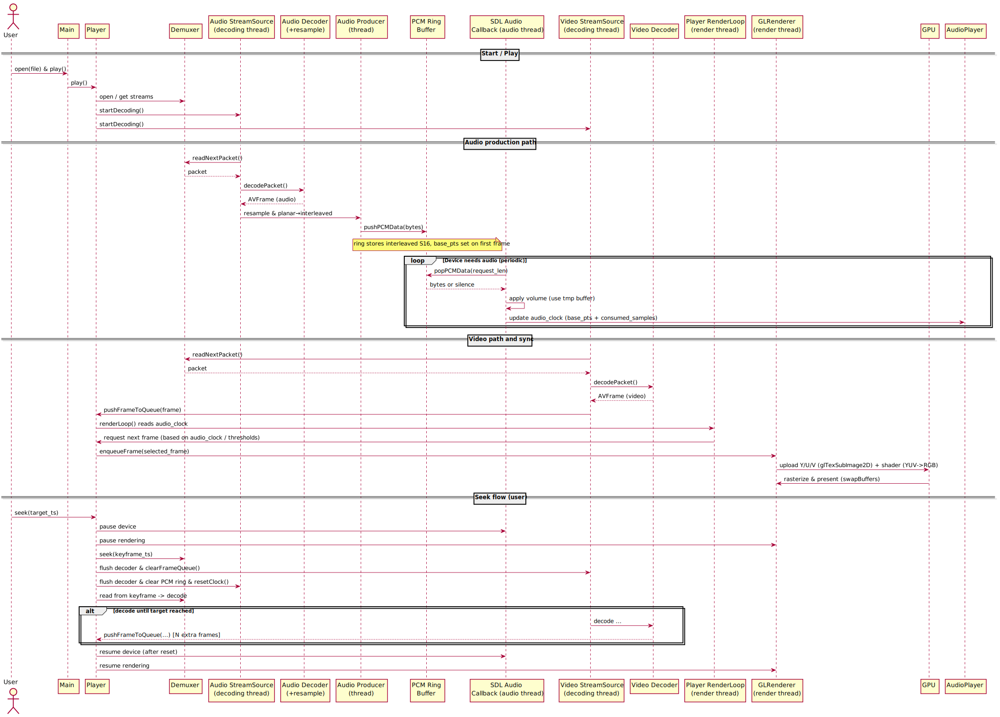

# RealTime-AV-Player

简介：一个实时音视频播放器，基于 FFmpeg 解码、SDL2 音频输出、OpenGL(GLFW+GLEW) 渲染，支持跨平台（Linux、Windows、macOS）

## 1. Architecture

- main：程序入口，窗口/事件循环与用户交互（按键、UI 状态），负责创建并协调 Player、AudioPlayer、GLRenderer 与 StreamSource。 
- Player（协调层）：统一同步策略与阈值（以音频为锚），控制帧调度、seek 流程与状态转换（play/pause/stop）。
- GLRenderer,AudioPlayer：分别负责视频渲染与音频播放，作为各自队列/缓冲的消费者运行在独立线程。
- StreamSource：负责从容器/demux 获取 AVPacket 并解码为 AVFrame，作为帧队列的生产者运行在独立线程。

## 2. Specification

1. 音视频流：采用生产-消费模式，读取线程持续从 Demuxer 获取 AVPacket 并解码为 AVFrame，推入线程安全的帧队列；渲染/播放线程异步消费。

2. 音频播放：采用 Pull-model，重采样线程（生产者）获取原始音频帧后，重采样为交错 S16 PCM 并写入环形缓冲区；音频播放线程通过音频回调（消费者）从环形缓冲拉取数据，并更新音频时钟用于 A/V 同步。

3. 视频渲染：获取视频帧后上传 YUV 纹理到 GPU，使用片段着色器在 GPU 上做 YUV→RGB 转换和色域/范围处理。渲染时序由 Player 控制，基于音频时钟决定取帧节奏，并在必要时丢帧以保持同步。

4. Seek 跳转逻辑：置音频播放、视频渲染于暂停状态，流读取线程于忙等并清空缓存。Demuxer 定位到目标时间戳后最近的关键帧，重新开始解码直到目标时间戳后额外 5 帧（确保画面流畅），恢复播放。

## 3. Sequence Diagram



## 4. Build && Run

### 4.1 Dependencies

- 必要库：FFmpeg >= 4.4 (libavformat, libavcodec, libavutil, libswscale, libswresample)。可使用二进制包或从源码编译（见下文）。
- 音频/视频/窗口：SDL2, GLFW, GLEW  
- 构建：CMake (>= 3.10)，C++17 兼容编译器（g++ 7+/clang++5+ 或 MSVC）  


### 4.2 Build

Linux (Ubuntu/Debian 示例 - 使用系统包)
```bash
# 构建（默认使用系统FFmpeg）
mkdir build && cd build
cmake .. -DUSE_SYSTEM_FFMPEG=ON
cmake --build . -j$(nproc)

# （可选）使用子模块管理 FFmpeg 源（如果选择源码方式）
git submodule add https://github.com/FFmpeg/FFmpeg.git third_party/ffmpeg
git submodule update --init --recursive
```

macOS (Homebrew)
```bash
brew update
brew install cmake pkg-config ffmpeg sdl2 glfw glew glm

mkdir -p build && cd build
cmake .. -DUSE_SYSTEM_FFMPEG=ON
cmake --build . -- -j$(sysctl -n hw.ncpu)
```

Windows (推荐用 vcpkg 或 MSYS2；下例使用 vcpkg)
```powershell
# 1) 安装 vcpkg（如尚未安装）
git clone https://github.com/microsoft/vcpkg.git third_party/vcpkg
cd third_party/vcpkg
.\bootstrap-vcpkg.bat

# 2) 安装依赖（x64 示例）
.\vcpkg.exe install ffmpeg[core]:x64-windows sdl2:x64-windows glfw3:x64-windows glew:x64-windows glm:x64-windows

# 3) 在项目根 build 目录运行 CMake，使用 vcpkg toolchain
mkdir build
cd build
cmake .. -DCMAKE_TOOLCHAIN_FILE=../third_party/vcpkg/scripts/buildsystems/vcpkg.cmake -DVCPKG_TARGET_TRIPLET=x64-windows -DUSE_SYSTEM_FFMPEG=ON
cmake --build . --config Release
```

使用仓库内 FFmpeg 源（源码方式，可重现构建）
```bash
# 假设已将 FFmpeg 放到 third_party/ffmpeg 并初始化子模块
# 1) 先在 third_party/ffmpeg 处编译 FFmpeg（示例最简）
cd third_party/ffmpeg
./configure --prefix="$(pwd)/install" --disable-doc --enable-shared
make -j$(nproc)
make install

# 2) 指定 CMake 查找已编译的 FFmpeg（FFMPEG_ROOT_DIR 指向 install 路径）
cd <repo_root>/build
cmake .. -DUSE_SYSTEM_FFMPEG=OFF -DFFMPEG_ROOT_DIR="../third_party/ffmpeg/install"
cmake --build . -j$(nproc)
```

### 4.3 Run

```bash
cd bin
./RealTimeAVPlayer ../install/assets/trump.mp4
```

### 4.4 Controls

- P/空格键：播放/暂停
- 左右方向键：快退/快进
- 上下方向键：音量调节
- Q/ESC：退出
- M：静音/取消静音


